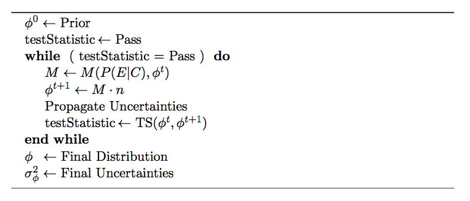

.. _mathematics:

:github_url: https://github.com/jrbourbeau/pyunfold

************************
Mathematical Derivations
************************

As introduced in the :doc:`overview`, the conceptually simplest way
to connect true causes :math:`C_{\mu}` and observable effects :math:`E_{j}`
is via a matrix :math:`R` and conversely by its estimated inverse :math:`M \approx R^{-1}`:

.. math::

    n(E) = R \ \phi(C) \\
    \phi(C) = M \ n(E)

Here

- :math:`\phi(C)` is the distribution of possible causes :math:`C_{\mu}, \, \mu \in [1, n_C]`
- :math:`n(E)` is the distribution of possible effects :math:`E_{j}, \, j \in [1, n_E]`

--------------------
Pseudo-Inverse of R
--------------------

To estimate the inverse matrix :math:`M`, we will effectively convolve what we know about the
cause-effect system through :math:`R` with a best estimate of what we think the cause distribution
looks like. 

We begin by stating Bayes' theorem for the problem:

.. math::

    P(C_{\mu} | E_{j}) = \frac{ P(E_{j} | C_{\mu}) \ P(C_{\mu})}{ \sum_{\nu}^{n_{C}} P(E_{j} | C_{\nu}) \ P(C_{\nu}) }

This equation dictates that having observed the effect :math:`E_{j}`, the probability that it is due 
to the cause :math:`C_{\mu}` is proportional to the product of the prior probability of that cause 
and the probability of that cause to produce that effect.
Hence, the elements :math:`P(E_{i}|C_{\mu})` represent the probability that a given :math:`C_{\mu}`
results in the effect :math:`E_i` and thus comprise the known or simulated response matrix :math:`R`.
The prior :math:`P(C_{\mu})` represents the current or best knowledge of the true (normalized) cause distribution. 

We then can connect the measured observed effects to their causes via

.. math::

    \phi(C_{\mu}) = \sum_{i=1}^{n_{E}} P(C_{\mu} | E_{i}) \ n(E_{i})

However, a cause may not necessarily result in any effect, i.e. there is a certain efficiency :math:`\epsilon_{\mu}`
associated with each cause:

.. math::

    0 \ \leq \ \epsilon_{\mu} \ = \sum_{j=1}^{n_E} \ P(E_j | C_{\mu}) \leq 1

Taking this into account in the estimate of :math:`\phi(C)`, we have

.. math::

    \begin{align}  
    \phi(C_{\mu}) &= \frac{1}{\epsilon_{\mu}} \sum_{i=1}^{n_{E}} P(C_{\mu} | E_{i}) \ n(E_{i}) \\
                  &= \sum_{i=1}^{n_{E}} M_{\mu i} \ n(E_{i})
    \end{align}

where the explicit form of :math:`M` is identified as

.. math::

    M_{\mu j} = \frac{ P(E_{j} | C_{\mu}) \ P(C_{\mu})}{ \left[ \sum_{k}^{n_E} P(E_k | C_{\mu})  \right] \, \left[ \sum_{\nu}^{n_{C}} P(E_{j} | C_{\nu}) \ P(C_{\nu}) \right]}

The components of :math:`M_{\mu j}` are:

- :math:`P(E_{j} | C_{\mu})` the known response matrix
- :math:`n(E_j)` the measured frequency distribution of effects
- :math:`P(C_{\mu})` the prior distribution of the causes

--------------------
Iterative Unfolding
--------------------

Having obtained the form of :math:`M` and thus an estimate of :math:`\phi(C)`,
we have a new best guess as to the form of the cause distribution.
By feeding in :math:`\phi(C)` as an updated prior, we can again get an improved estimate
of the cause distribution.
Shortening the notation by keeping Latin subscripts for effect indices and Greek subscripts for the causes, 
we can then obtain :math:`\phi(C)^{t+1}` at iteration :math:`t+1` via

.. math::

    \begin{align}
    \phi_{\mu}^{t+1} &= \sum_j M_{\mu j}^t n_j \\
    M_{\mu j}^t &= \frac{P_{\mu j} \, \phi^t_{\mu}}{ \epsilon_{\mu} \sum_{\rho} P_{\rho j} \, \phi^{t}_\rho}
    \end{align}

where :math:`\phi^t` is the cause distribution at iteration :math:`t`, and 
:math:`P_{\mu j}` are the elements of the **response matrix**.
Thus we have built an iterative unfolding procedure.
Using an appropriate test statistic such as a K-S test to compare :math:`\phi^t_{\mu}` 
and :math:`\phi^{t+1}_{\mu}`, we can decide when subsequent iterations provide negligible improvements,
and after which the unfolding is said to have converged.

The algorithm which PyUnfold employs is illustrated by the following:

An exhaustive description and derivation of the propagation of uncertainties can be found in the
`LaTeX documentation <https://github.com/jrbourbeau/pyunfold/blob/master/docs/latex_writeup/main.pdf>`_
provided with PyUnfold.

--------------------
The Initial Prior
--------------------

Since one apparently has freedom as to the form of :math:`P(C_{\mu})`, it is typical 
to avoid introducing bias by setting the initial prior to either the uniform prior,
where all cause bins have equal probability, or the non-informative Jeffreys' Prior [1]_
which is especially appropriate when the range of causes spans several orders of magnitude.
These take the form

.. math::

    \begin{align}
      P(C_{\mu})^{\text{uniform}}  &= \frac{1}{n_{C}} \\
      P(C_{\mu})^{\text{Jeffreys}} &= \frac{1}{\log \left( C_{\text{max}} / C_{\text{min}}\right) \, C_{\mu}}
    \end{align}

While users can provide a custom initial prior, the uniform prior is the default in PyUnfold.
Provided the minimum and maximum values of causes, the Jeffreys' prior is provided as a utility function.

.. [1] H. Jeffreys, “An Invariant Form for the Prior Probability in Estimation Problems”, Proc. of the Royal Society of London A **186** (1946) 453.
